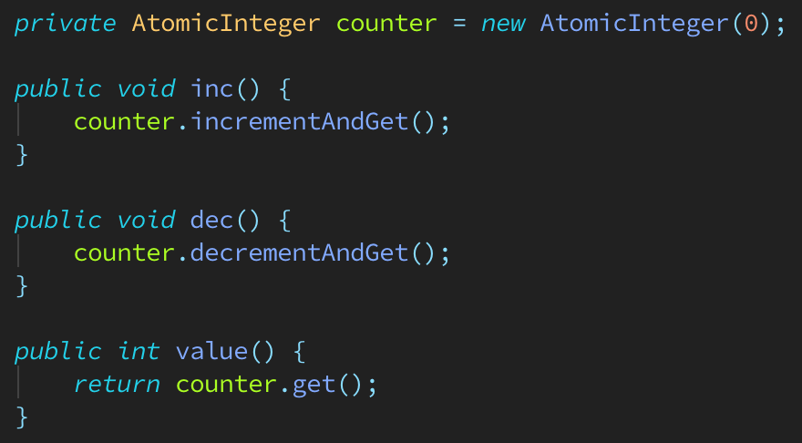

# Other related topics:

Here we will discuss some loose ends related to threads that didn't fit into the previous examples.
First, let's remind ourselves of what an atomic action means. As we've seen, when a thread is running,
it can be suspended when it's in the middle of doing something.

For example, if a thread calls the System.out.println() method, it can be suspended in the middle of
executing the method. It may have evaluated the argument that's being passed, but it's suspended before
it can print the result. Or it may be partway through evaluating the argument when it's suspended.
Essentially, System.out.println() isn't an atomic action.

An atomic action can't be suspended in the middle of being executed. It either completes, or it doesn't
happen at all. Once a thread starts to run an atomic action, we can be confident that it won't be
suspended until it has completed the action.

In Java, we mentioned that the following operations are atomic:

1. Reading and writing reference variables. For example, the statement myObject1 = myObject2 would be atomic.
   A thread can’t be suspended in the middle of executing this statement.

2. Reading and writing primitive variables, except those of type long and double. The JVM may require
   two operations to read and write longs and doubles, and a thread can be suspended between each operation.
   For example, a thread can’t be suspended in the middle of executing myInt = 10. But it can be suspended
   in the middle of executing myDouble = 1.234.

3. Reading and writing all variables declared volatile.

Now take a look at the third item: volatile. You may think that since we don’t have to worry about thread
interference with atomic actions, that we don’t need to synchronize them, but that isn’t true. Because of
the way Java manages memory, it’s possible to get memory consistency errors when multiple threads can read
and write the same variable.

Java’s memory management model is outside the scope here. All we need to know is that each thread has a
CPU cache, which can contain copies of values that are in main memory. 

Since it’s faster to read from the cache, this can improve the performance of an application.
There would not be a problem if there was only one CPU, but these days, most computers have more than one CPU.

When running an application, each thread may be running on a different CPU, and each CPU has its own cache.
It’s possible for the values in the caches to become out of synch with each other,
and with the value in main memory - a memory consistency error.

Suppose we have two threads that use the same int counter. Thread1 reads and writes the counter. Thread2
only reads the counter. As we know, reading and writing to an int is an atomic action. A thread won’t be
suspended in the middle of reading or writing the value to memory. But let’s suppose that Thread1 is running
on CPU1, and Thread2 is running on CPU2. Because of CPU caching, the following can happen:

1. The value of the counter is 0 in main memory.
2. Thread1 reads the value of 0 from main memory.
3. Thread1 adds 1 to the value.
4. Thread1 writes the value of 1 to its CPU cache.
5. Thread2 reads the value of counter from main memory and gets 0, rather than the latest value, which is 1.

This is where volatile variables come in. When we use a non-volatile variable the JVM doesn’t guarantee when
it writes an updated value back to main memory. But when we use a volatile variable, the JVM writes the value
back to main memory immediately after a thread updates the value in its CPU cache. It also guarantees that
every time a variable reads from a volatile variable, it will get the latest value.

To make a variable volatile, we use the volatile keyword.

    public volatile int counter;

A thread can be suspended between any of these steps. As a result, the following could happen:

1. Thread1 reads the value of counter and gets 5.
2. Thread1 suspends.
3. Thread2 reads the value of counter and get 5. It adds 1 to the value and writes 6 to counter, then suspends.
4. Thread3 reads the value of counter and get 6. It adds 1 to the value and writes 7 to counter, then suspends.
5. Thread1 runs again. It adds 1 to the value of 5 and writes 6 to counter.
6. Oops.

Of course, we can come up with more run sequence that would lead to the value of counter being compromised.
Declaring the counter variable as volatile is one potential solution, but we've learned that memory consistency
errors can still be possible, which would be true here for the inc() and dec() method. Since a thread changes
the value of counter in a way that depends on the existing value of counter, the values within the thread CPU
caches may get out of syncs with the value in main memory.

Instead of using an int counter, we'll update the code to use an AtomicInteger object. When using one of the
Atomic types, we don't have to worry about thread interference. As the Java documentation states, the classes
in the java.concurrent.atomic package "support lock-free thread-safe programming on single variables."
(Documentation for the package is [here](https://docs.oracle.com/javase/8/docs/api/java/util/concurrent/atomic/package-summary.html) )

We declare the counter as type AtomicInteger and pass 0 as the initial value. In the inc() method, we use
incrementAndGet(). This automatically increases the value by 1. The method decrementAndGet() decreases the
value by 1. To get the value, we call the get() method. We don't have to synchronize the increment or
decrement operations in any way.

The following code block is a simple example:

 

We can't use AtomicInteger as a substitute for an Integer object. AtomicIntegers are meant to be used in
specific situations like the one above: when thread interference can take place because a thread is changing
the value of the variable in a way that depends on the existing value. If you take a look at the documentation
for the AtomicInteger class, you'll see that there are a limited number of methods, and most allow us to
operate on the existing value of the Atomic variable.

There are Atomic classes for the following types: boolean, integer, integer array, long, long array, object reference,
and double. Remember that we said reading and writing long and double variables isn't Atomic? Well, we could use the
AtomicLong and AtomicDouble classes to make these operations Atomic.
(documentation is [here](https://docs.oracle.com/javase/8/docs/api/java/util/concurrent/atomic/AtomicInteger.html))

The Atomic classes have set() and get() methods that allow us to set a value, and get the current value.
But the Atomic classes are really meant to be used in situations when a value is being incremented or decremented.
They're intended to be used when the code is using a loop counter, or generating a sequence of numbers
for some other reason. One other method we’ll briefly mention for the Atomic classes is the compareAndSet() method.
This method takes two parameters: the expected value, and the new value that you want to set. If the current
value doesn’t equal the expected value, the method returns false and the set doesn’t take place.

If the current value equals the expected value, then the set goes ahead and the method returns true.
We can see how this would be useful when a thread knows that it might be suspended between getting a value and updating it.
