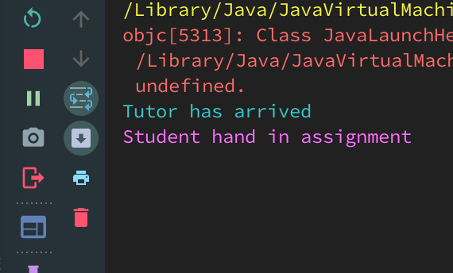

# Deadlock in this example

This example demonstrates an example of deadlock, here is a potential sequence:

1. The Tutor thread calls tutor.studyTime().
2. The Tutor thread gets the lock for the Tutor object (because the studyTime() method is synchronized). It prints "Tutor has arrived" and waits for the student, which we've simulated by calling sleep().
3. The Student thread runs and calls handInAssignment(). Since the method is synchronized, it gets the lock for the Student object. It calls tutor.getProgressReport(), but the Tutor thread is holding the lock fot the tutor object, so the Student thread blocks.
4. The Tutor thread wakes up and runs, and calls student.startStudy(). But the method is synchronized, and the Student is holding the lock for the Student object, so the Tutor thread blocks.
5. We have a deadlock. Neither thread will ever release the lock that the other thread is waiting for.

Essentially, the threads are trying to acquire the same set of locks in a different order, which often results in a deadlock. The tutor thread gets the Tutor lock and then wants the Student lock. The student thread gets the Student lock and then wants the Tutor lock.
The execution result might looks like the following screenshot:

 
