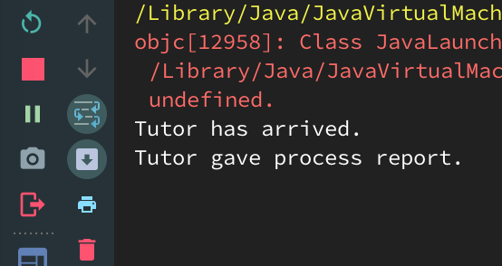

# Example That Still Deadlock

This example demonstrates just how tricky it can be to work with threads.
Now let's take a look at the sequence to see why there're still deadlocked:

1. The tutor thread calls the tutor.studyTime() method. It acquires the Tutor lock,
and then the Student lock.
2. The tutor thread reaches the this.wait() line of code. When it executes wait(),
it releases the tutor lock. Recall that the wait() and notifyAll methods must be called
from within synchronized blocks. To call wait() on an object, a thread must be holding
the object's lock. When it calls wait(), it release the lock.
3. The student thread runs the handInAssignment() method. It gets the tutor lock and
calls getProgressReport(). It then tries to get the student lock, but the tutor thread
is still holding it. Because of that, the student thread can't notify the tutor thread.
4. Deadlock occurred.

The execution result is like this:

 

The tricky part here is that it looks like the two threads have to obtain the locks
in the same order. From a casual look at the code, it doesn't seem possible for a
thread to get the tutor lock and then block on getting the student lock. But because
wait() results in a thread releasing the lock until it's notified, the student can
obtain the tutor lock while the tutor thread is still holding the student lock.

We'll add another item to the "what to check if the code is deadlocking" list.
Take a look at places where the code calls wait() and see if that may cause a deadlock.
The wait() method results in a thread releasing a lock before it has exited the synchronized
block, and this premature (albeit temporary) release can lead to problems if we're not careful.

How would we fix this? It will depend on the code. Perhaps using ReentrantLock objects
would work better. We could have the tutor thread release the student lock before
it calls wait(), and then try to reacquire it again it wakes up.
