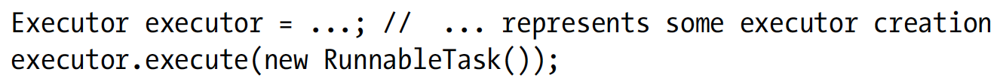

# Concurrency Utilities and Executors

* Before this note, we've known something about Java's low-level support for threads.
  Here, we'll focus to Java’s high-level thread support, which is known as the concurrency utilities.
  Think of the concurrency utilities as being analogous to writing applications in a high-level language
  and its low-level thread support as being analogous to writing applications in assembly language.

* Introducing the Concurrency Utilities
    * There are some problems about Java's low-level threads support:

        * Low-level concurrency primitives such as synchronized and wait()/notify() are often
          hard to use correctly. Incorrect use of these primitives can result in race conditions,
          thread starvation, deadlock, and other hazards, which can be hard to detect and debug.

        * Too much reliance on the synchronized primitive can lead to performance issues,
          which affect an application’s scalability. This is a significant problem for
          highly-threaded applications such as web servers.

        * Developers often need higher-level constructs such as thread pools and semaphores.
          Because these constructs aren't included with Java’s low-level thread support, developers
          have been forced to build their own, which is a time-consuming and error-prone activity.

    * To solve these problems, JDK5 introduced the concurrency utilities,
      this framework consists of various types in the following packages:

        * java.util.concurrent: Utility types that are often used in concurrent programming,
          for example, executors.

        * java.util.concurrent.atomic: Utility classes that support lock-free thread-safe
          programming on single variables.

        * java.util.concurrent.locks: Utility types that lock and wait on conditions
          (objects that let threads suspend execution, wait until notified by other threads
          that some boolean state may now be true). Locking and waiting via these types
          is more performant and flexible than doing so via Java’s monitor-based synchronization
          and wait/notification mechanisms.

    * The concurrency utilities can be classified as executors, synchronizers, a locking
      framework, and more.

* Exploring Executors
    * The Threads API lets you execute runnable tasks via expressions such as new java.
      lang.Thread(new RunnableTask()).start(); These expressions tightly couple task
      submission with the task's execution mechanics (run on the current thread, a new thread,
      or a thread arbitrarily chosen from a pool group of threads).
      A task is an object whose class implements the java.lang.Runnable interface
      (a runnable task) or the java.util.concurrent.Callable interface (a callable task).

      * An executor is an object whose class directly or indirectly implements
        the java.util.concurrent.Executor interface, which decouples task submission
        from task-execution mechanics.

      * Executor declares a solitary void execute(Runnable runnable) method that
        executes the runnable task named runnable at some point in the future. execute()
        throws java.lang.NullPointerException when runnable is null and java.util.
        concurrent.RejectedExecutionException when it cannot execute runnable.

      * RejectedExecutionException can be thrown when an executor is shutting down
        and doesn't want to accept new tasks. Also, this exception can be thrown when the executor
        doesn't have enough room to store the task (perhaps the executor uses a bounded blocking
        queue to store tasks and the queue is full.

      * The following example presents the Executor equivalent of the aforementioned new
        Thread(new RunnableTask()).start(); expression:  
          

      * Although Executor is easy to use, this interface is limited in various ways:
        * Executor focuses exclusively on Runnable. Because Runnable's run() method doesn't
          return a value, there's no easy way for a runnable task to return a value to its caller.

        * Executor doesn't provide a way to track the progress of runnable tasks that are executing,
          cancel an executing runnable task, or determine when the runnable task finishes execution.

        * Executor cannot execute a collection of runnable tasks.

        * Executor doesn't provide a way for an application to shut down an executor
          (much less properly shut down an executor).

      * These limitations are addressed by the java.util.concurrent.ExecutorService
        interface, which extends Executor and whose implementation is typically a thread pool.

