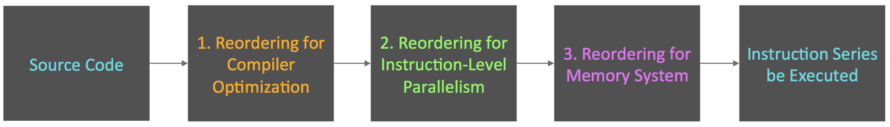

# About Java Memory Model (JSR 133)

* 在並發(Concurrency)環境下, 我們需要處理兩個關鍵問題:
    * 執行緒之間如何通信
    * 執行緒之間如何同步

* 所謂的通信, 指的是執行緒之間透過何種機制來交換訊息

* 在命令式編程(Imperative programming)中, 執行緒之間的通信機制有兩種:
    * 共享記憶體 (shared memory): 在此種並發模型裡, 執行緒之間共享程式的公共狀態, 執行緒之間通過讀寫記憶體中的公共狀態來隱式的進行通信.
    * 消息傳遞: 執行緒之間沒有公共狀態, 執行緒之間必須通過明確的發送消息來顯式地進行通信.

* 同步: 意為程式用於控制不同執行緒之間操作發生的相對順序之機制, 依模型分類如下:
  * 共享記憶體(shared memory model): 同步是顯式(explicitly)進行的, 我們必須顯式地指定某個方法或某段程式需要在執行緒之間互斥執行.
  * 訊息傳遞: 由於訊息的發送必須在訊息的接收之前, 因此同步是隱式(implicitly)進行的.

* Java Concurrency採用shared memory model, Java thread之間的通信總是隱式地進行.

* Java Memory Model的抽象
    * 在Java中, 所有instance field, static field和陣列元素都儲存在heap memory中, heap memory在執行緒之間共享(以下皆以"共享變數"代表instance field, static field 與陣列元素).
    * 區域變數(Local variables), 方法定義參數(formal method parameters)和例外處理器參數(exception handler parameters)不會在執行緒之間共享, 它們不會有記憶體能見度的問題, 也不受記憶體模型的影響.

* Java執行緒之間的通信由Java記憶體模型(Java Memory Model, JMM, a.k.a JSR-133)控制, JMM決定一個執行緒對共享變數的寫入何時對另一個執行緒可見.
* 從抽象的角度來看, JMM定義了執行緒和主記憶體(main memory)之間的抽象關係:
  執行緒之間的共享變數儲存在主記憶體中, 每個執行緒都有一個私有的區域記憶體(local memory), 區域記憶體中儲存了該執行緒用以讀寫共享變數的副本.
  區域記憶體是JMM的一個抽象概念, 它並不是真實存在的. 其涵蓋了快取, 寫入緩衝區, 暫存器以及其他的硬體和編譯器最佳化. JMM的抽象示意圖如下:   
    

* 單就這張圖來看, 執行緒A跟B之間要通信的話, 基本上要經過以下兩步驟:
    * 執行緒A把區域記憶體中更新過的共享變數更新到主記憶體裡去.
    * 執行緒B到主記憶體去讀取執行緒A之前已經更新過的共享變數.

* 流程示意圖如下:   
    

  如上圖所示, 區域記憶體A與B有主記憶體中共享變數x的副本. 假設初始狀態時, 這三個記憶體中的x都為0. 執行緒A在執行時, 把更新後的x(假設x=1)臨時存放在區域記憶體A中.
  當執行緒A和B需要通信時, 執行緒A首先會把自己區域記憶體中修改後的x更新至主記憶體中, 此時主記憶體中的x就變成了1. 再來, 執行緒B到主記憶體中去讀取執行緒A更新後的x,
  然後執行緒B的區域記憶體的x也變為了1. 從整體來看, 這兩個步驟實質上是執行緒A在向執行緒B發送訊息, 且此通信過程必須要經過主記憶體.
  JMM通過控制主記憶體與每個執行緒的區域記憶體之間的互動, 來為Java developer提供記憶體可見性的保證.

* 重排序
    * 在執行程式時為了要提高性能, 編譯器和處理器常常會對指令做重排序的動作. 重排序大致可分為以下三種:
        * 編譯器最佳化的重排序: 編譯器在不改變單一執行緒程式語意的前提下, 可以重新安排語句的執行順序
        * 指令級平行的重排序: 現代的處理器採用了指令級平行技術(Instruction-Level Parallelism, LIP)來將多條指令重疊執行. 如果不存在資料相依性, 處理器可以改變語句對應機器指令的執行順序.
        * 記憶體系統的重排序: 由於處理器使用快取和讀/寫緩衝區, 這使得加載和儲存操作看上去可能是在亂序執行.

    * 從Java原始碼到最終實際執行的指令序列, 分別會經歷下面三種重排序:   
        
        * 上述的1屬於編譯器重排序, 2與3都屬於處理器重排序. 這些重排序都可能會導致多執行緒程式出現記憶體可見性的問題. 對於編譯器, JMM的編譯器重排序規則會禁止特定類型的編譯器重排序(並不是所有的編譯器重排序都要禁止). 對於處理器重排序, JMM的處理器重排序規則會要求Java編譯器在生成指令序列時, 插入特定類型的記憶體屏障(memory barriers, intel稱之為memory fence)指令, 通過對記憶體屏障指令來禁止特定類型的處理器重排序(並非所有的處理器重排序都要禁止).

    * JMM屬於語言級的記憶體模型, 其確保在不同的編譯器和不同的處理器平台之上, 通過禁止特定類型的編譯器重排序和處理器重排序, 為開發者提供一致的記憶體可見性保證.

* 處理器重排序與記憶體屏障指令
    * 現在的處理器使用寫入緩衝區來臨時保存向記憶體寫入的資料. 寫緩衝區可以保證指令的pipeline持續運行, 其可以避免由於處理器停頓下來等待向記憶體寫入資料而產生的延遲.
      同時, 通過以批次處理的方式刷新寫緩衝區, 以及合併寫緩衝區中對同一記憶體位址的多次寫入動作, 可以減少對memory bus的佔用. 雖然寫緩衝區有這麼多好處,
      但每個處理器上的寫緩衝區, 僅僅對其所在的處理器可見. 這個特性會對記憶體操作的執行順序產生重要的影響, 即: 處理器對記憶體的讀/寫操作的執行順序,
      不一定與記憶體實際發生的讀/寫操作順序一致. 為了具體說明, 請見以下範例:  
        

