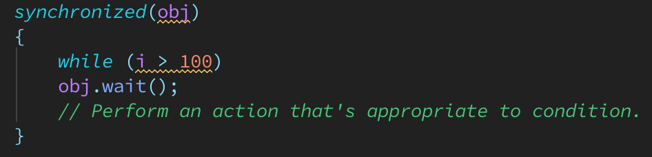

# Wait and Notification

* The java.lang.Object class provides a Wait-and-Notify API that consists of three wait()
  methods, one notify() method, and one notifyAll() method. The wait() methods
  wait for a condition to exist; the notify() and notifyAll() methods notify waiting
  threads when the condition exists.

* The waiting threads are known as the wait set. Because the condition queue is tightly
  bound to an object’s lock, all five methods must be called from within a synchronized
  context (the current thread must be the owner of the object’s monitor);
  otherwise, java.lang.IllegalMonitorStateException is thrown.  
    
  The wait() method is called from within a synchronized block that synchronizes on
  the same object as the object on which wait() is called (obj). Because of the possibility
  of spurious wakeups (a thread wakes up without being notified, interrupted, or timing
  out), wait() is called from within a while loop that tests for the condition holding and
  re-executes wait() when the condition still doesn't hold. After the while loop exits, the
  condition exists and an action appropriate to the condition can be performed.

* Never call a wait() method outside of a loop. The loop tests the condition
  before and after the wait() call. Testing the condition before calling wait() ensures
  liveness. If this test was not present, and if the condition held and notify() had been
  called prior to wait() being called, it’s unlikely that the waiting thread would ever wake
  up. Retesting the condition after calling wait() ensures safety. If retesting didn't occur, and
  if the condition didn't hold after the thread had awakened from the wait() call (perhaps
  another thread called notify() accidentally when the condition didn't hold), the thread
  would proceed to destroy the lock’s protected invariants.
