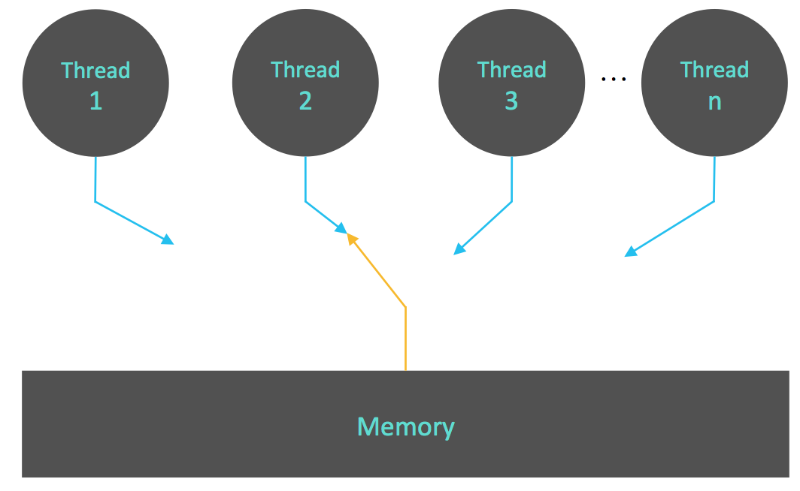
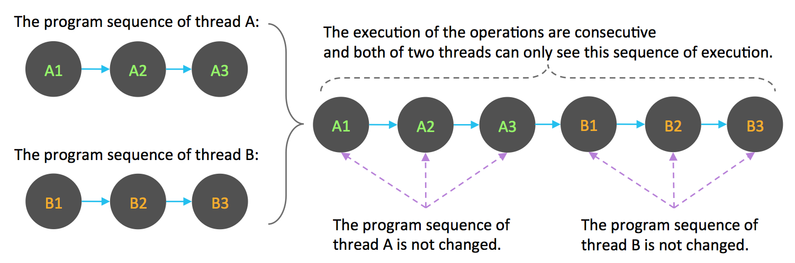
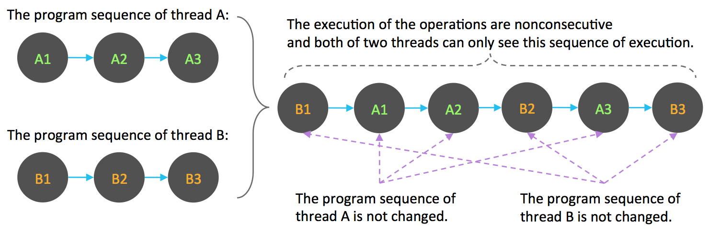
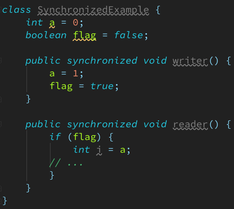
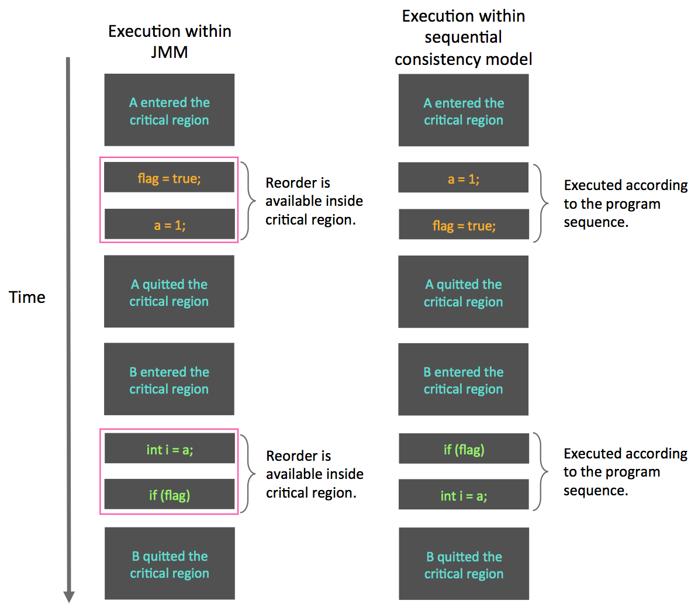
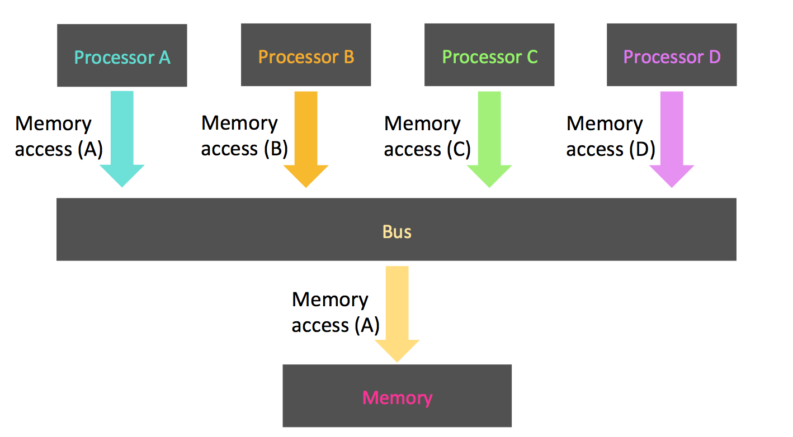
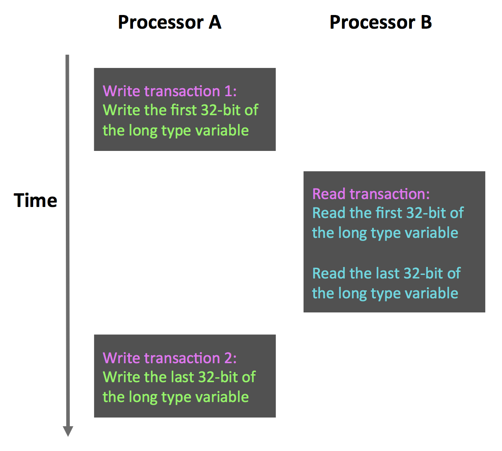

# About Java Memory Model (JSR 133) - Sequentially Consistency

* 資料競爭與順序一致性的保證
    * 當程式未正確同步時, 就會存在資料競爭(Data Race). JMM Spec對資料競爭的定義如下:
        * 在一個執行緒中寫一個變數
        * 在另一個執行緒讀同一個變數
        * 且寫和讀都沒有通過同步來排序

    * 當程式中存在資料競爭時, 程式的執行往往產生違反直覺的結果(前一章節的範例就是這樣).
      若一個多執行緒程式能夠正確地同步, 這個程式就是一個沒有資料競爭的程式.

    * JMM對正確同步的多執行緒程式之記憶體一致性做了以下保證:
        * 若程式是正確同步的, 程式的執行將具有順序一致性(Sequentially Consistency) --
          即程式的執行結果與該程式在順序一致性記憶體模型中的執行結果相同(這對開發者來說是一個極強的保證).
          此處的同步指的是廣義上的同步, 包括對常用同步語意(lock, volatile與final)的正確使用.

* 順序一致性記憶體模型
    * 順序一致性記憶體模型是一個被計算機科學家理想化了的理論參考模型, 其為開發者提供了極強的記憶體可見性保證.
      此模型有兩大特性:
        * 一個執行緒中的所有操作必須按照程式的順序來執行
        * (無論程式是否同步)所有執行緒都只能看到一個單一的操作執行順序.
          在順序一致性記憶體模型中, 每個操作都必須原子執行且立刻對所有執行緒可見.

    * 順序一致性記憶體模型為開發者提供的視圖如下:  
        

    * 在概念上, 順序一致性模型有一個單一的全局記憶體(global memory), 這個記憶體通過一個左右擺動的開關可以連接到任意一個執行緒.
      同時, 每個執行緒必須按程式的順序來執行記憶體的讀/寫操作. 從上圖中我們可以看出, 在任意時間點最多只能有一個執行緒可以連接到記憶體.
      當多個執行緒並發執行時, 圖中的開關就可以把所有執行緒的記憶體讀/寫操作序列化.

      為了更好地理解, 下面通過兩個示意圖來對順序一致性模型的特性做進一步的說明.
      假設有兩個執行緒A與B並發執行. 其中A有三個操作, 這些操作在程式中的順序是: A1->A2->A3.;
      B也有三個操作, 順序是: B1->B2->B3.

      假設這兩個執行緒使用監視器(monitor, monitor lock)來正確地同步: A的三個操作執行後釋放monitor,
      隨後B取得同一個monitor. 那麼程式在順序一致性模型中的執行效果將會如下圖所示:  
        

      現在我們假設這兩個執行緒沒有做同步, 下圖是這個未同步程式在順序一致性模型中的執行示意圖:  
        

      未同步程式在順序一致性模型中雖然整體執行順序是無序的, 但所有執行緒都只能看到一個一致的整體執行順序.
      以上圖為例, 執行緒A與B看到的執行順序都是: B1->A1->A2->B2->A3->B3.
      之所以能得到這個保證是因為此模型中的每個操作都必須立即對任意執行緒可見.

      然而, 在JMM中就沒有這個保證. 未同步程式在JMM中不但整體的執行順序是無序的, 而且所有執行緒看到的操作執行順序也可能不一致.
      譬如說, 在當前執行緒把寫過的資料快取在區域記憶體中(local memory), 且還沒更新至主記憶體(main memory)之前,
      這個寫操作就僅對當前執行緒可見; 從其他執行緒的角度來觀察, 會認為這個寫操作根本還沒有被當前執行緒執行.
      只有當前執行緒把區域記憶體中寫過的資料更新至主記憶體後, 這個寫操作才能對其他執行緒可見.
      在這種情況下, 當前執行緒和其他執行緒看到的操作執行順序就不會一致了.

* 同步程式的順序一致性效果
    * 以下就對前面章節的範例程式用monitor來同步, 看看正確同步的程式如何具有順序一致性, 範例程式如下:  
        

    * 上面的範例程式中, 假設A執行緒執行writer方法後, B執行緒執行reader方法. 這是一個正確同步的多執行緒程式.
      根據JMM spec, 該程式的執行結果將與該程式在順序一致性模型中的執行結果相同. 下面是該程式在兩個記憶體模型中的執行時序對比圖:  
        

    * 在順序一致性模型中, 所有操作完全按程式的順序序列執行. 然而在JMM中, 臨界區(critical region)內的程式可以重排序
      (但JMM不允許臨界區內的程式"逸出"臨界區之外, 那樣會破壞monitor的語意). JMM會在退出monitor和進入monitor這兩個
      關鍵時間點做一些特別處理, 使得執行緒在這兩個時間點具有與順序一致性模型相同的記憶體視圖(具體細節之後會說明).
      雖然執行緒A在臨界區內進行了重排序, 但由於monitor的互斥執行特性, 這裡的執行緒B根本無法察覺到執行緒A在臨界區內進行的重排序.
      這種重排序既提高了執行效率, 又不會改變程式的執行結果.

      從這裡我們可以看到JMM在具體實作上的基本方針: 在不改變(正確同步的)程式執行結果的前提下, 盡可能的為編譯器和處理器的最佳化而努力.

* 未同步程式的執行特性
    * 對於未同步或未正確同步的多執行緒程式, JMM只提供最小安全性: 執行緒執行時讀取到的值, 要就是之前某個執行緒寫入的值,
      不然就是默認值(0, null, false), JMM保證執行緒讀操作讀取到的值不會無中生有的跑出來. 為了實現最小安全性,
      JVM在heap上分配物件時, 首先會清空記憶體空間, 然後才會在上面分配物件(JVM內部會同步這兩個操作).
      因此, 在已清空的記憶體空間(pre-zeroed memory)分配物件時, field的預設初始化已經完成了.

    * JMM不保證未同步程式的執行結果與該程式在順序一致性模型中的執行結果一致. 因為未同步程式在順序一致性模型中執行時,
      整體上是無序的, 其執行結果無法預知. 保證未同步程式在兩個模型中的執行結果一致基本上沒有意義.

    * 未同步程式在這兩個模型中的執行特性有下面幾個差異:
        * 順序一致性模型保證單執行緒內的操作會按程式的順序執行, 而JMM不保證單執行緒內的操作會按照程式的順序執行
          (譬如上面正確同步的多執行緒程式在臨界區內的重排序).
        * 順序一致性模型保證所有執行緒只能看到一致的操作執行順序, 而JMM不保證所有執行緒能看到一致的操作執行順序.
        * JMM不保證對64-bit的long/double型別變數的讀/寫具有原子性, 而順序一致性模型保證對所有的記憶體讀/寫都具有原子性.

    * 上面提到的第三個差異與處理器匯流排的工作機制密切相關. 在計算機中, 資料通過匯流排在處理器與記憶體之間傳遞.
      每次處理器和記憶體之間的資料傳遞都是同過一系列步驟來完成的, 這一系列步驟稱之為bus transaction.
      Bus transaction包含了read transaction與write transaction. Read transaction從記憶體傳送資料到處理器,
      write transaction從處理器傳送資料到記憶體, 每個transaction會讀/寫記憶體中一個或多個物理上連續的byte.
      此處的關鍵是, bus會同步那些試圖並發使用bus的transaction. 在一個處理器執行bus transaction的期間,
      bus會禁止其它所有的處理器和I/O設備執行記憶體的讀/寫. 以下示意圖用來說明bus的工作機制:  
        

      如上圖所示, 假設處理器A, B和C同時向bus執行bus transaction, 此時bus arbitration(想成是一個仲裁即可)會對這種race作出裁決,
      這裡我們假設bus在仲裁後判定處理器A在race中獲勝(仲裁會確保所有處理器都能公平的存取記憶體).
      此時處理器A繼續其bus transaction, 而其它兩個處理器則要等待處理器A的transaction完成後才能開始再次執行記憶體存取.
      假設在處理器A執行transaction期間(不管是讀還是寫), 處理器D向bus執行了bus transaction, 此時處理器D的這個請求會被bus禁止.

      Bus的這些工作機制可以把所有處理器對記憶體的存取以序列化的方式來執行; 在任意時間點, 最多只能有一個處理器能存取記憶體.
      這個特性確保了單個bus transaction之中的記憶體讀/寫操作具有原子性.

      在ㄧ些32-bit的處理器上, 如果要求對64-bit的資料讀/寫操作具有原子性, 會有比較大的開銷.
      為了照顧這種處理器, Java語言規範鼓勵但不強求JVM對64-bit的long/double型別變數的讀/寫具有原子性.
      當JVM在這種處理器上運行時, 會把一個64-bit的long/double變數的讀/寫拆分為兩個32-bit的讀/寫操作來執行.

    * 當單個記憶體操作不具有原子性, 將可能會發生預期之外的結果, 以下是示意圖:  
        
      如上圖所示, 假設處理器A寫了一個long變數, 同時B處理器要讀這個變數. 處理器A中64-bit的寫操作被拆成兩個32-bit的寫操作,
      且這兩個32-bit的寫操作被分配到不同的write transaction中執行. 同時處理器B中64-bit的讀操作被拆分為兩個32-bit的讀操作,
      且這兩個32-bit的讀操作被分配到同一個的read transaction中執行.
      當處理器A和B按照上圖的順序執行時, 處理器B就只會看到被處理器A"寫了一半"的無效值.

