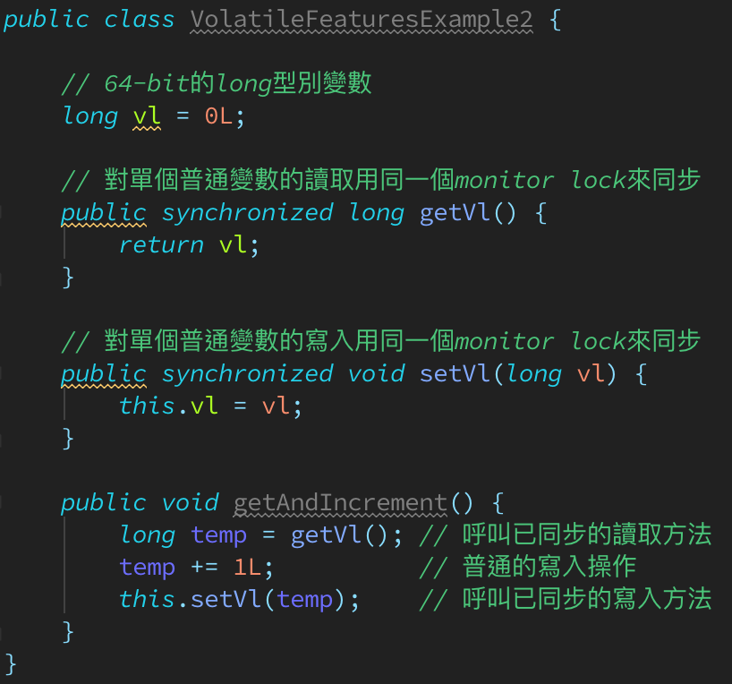

# About Java Memory Model (JSR 133) - Volatile

* volatile的特性
    * 當我們宣告共享變數為volatile後, 對這個變數的讀/寫就會變得比較特別.
      理解volatile特性的一個好方法是: 把對volatile變數的單個讀/寫,
      看成是使用同一個monitor lock對這些單個讀/寫操作做了同步.
      以下通過具體的範例來說明, 首先是範例程式:  
        

    * 假設有多個執行緒分別呼叫上面範例的三個方法, 那這個程式在語意上和下面這個範例程式是等價的:  
        

    * 如上面範例程式所示, 對一個volatile變數的單個讀/寫操作,
      與對一個普通變數的讀/寫操作使用同一個monitor lock來同步, 其之間的執行效果是相同的.

    * Monitor lock的happens-before規則保證釋放monitor和獲取monitor的兩個執行緒之間的記憶體可見性,
      這意味著對一個volatile變數的讀, 總是能看到(任意執行緒)對這個volatile變數最後的寫入.

    * Monitor lock的語意決定了臨界區(critical region)的執行具有原子性. 這意味著即使是64-bit的long/double變數,
      只要其為volatile變數, 對該變數的讀寫就將具有原子性. 倘若是多個volatile操作或類似於volatile++這種複合操作,
      這些操作整體上就不具有原子性了.

    * 簡單來說, volatile變數本身具有下列特性:
        * `可見性(visibility)`: 對`一個volatile變數的讀`, 總是能看到(任意執行緒)對這個volatile變數最後的寫入.
        * `原子性(atomicity)`: 對`任意單個volatile變數`的讀/寫具有原子性, 但`對於volatile++這種複合操作就不具備原子性`.

* volatile寫入-讀取建立的happens-before關係

* volatile寫入-讀取的記憶體語意

* volatile記憶體語意的實作

* JSR-133為何要增強volatile的記憶體語意
