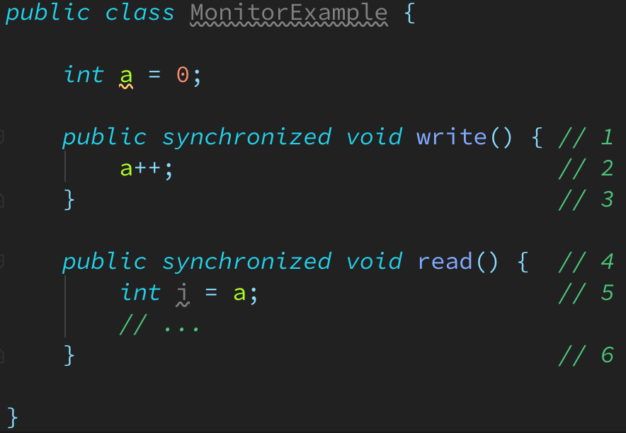
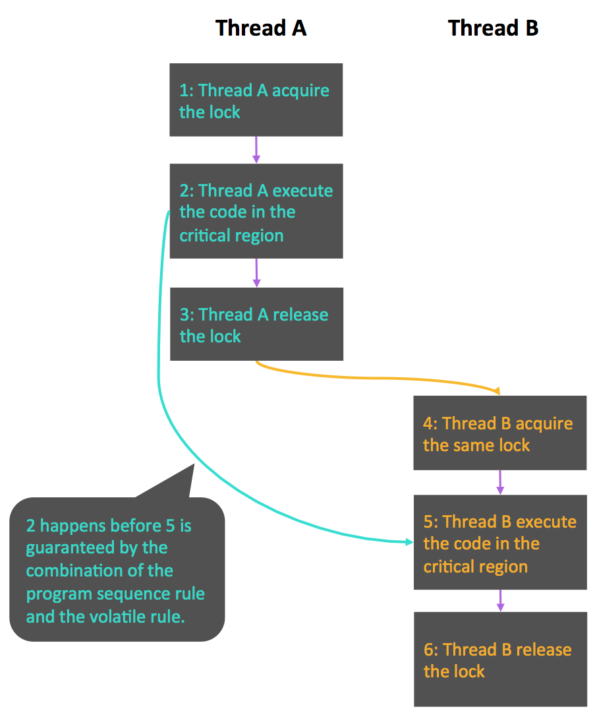

# About Java Memory Model (JSR 133) - Lock

* Lock的釋放(release)-獲取(acquire)建立的happens before關係
    * Lock是Java concurrency中最重要的同步機制. Lock除了讓critical region互斥執行之外,
      還可以讓釋放lock的執行緒向獲取同一個lock的執行緒發送訊息.
    * 以下是lock release-acquire的範例程式:  
        
    * 假設執行緒A執行write方法, 隨後執行緒B執行read方法.
      根據happens-before規則, 這個過程包含的happens-before關係可以分為兩類:
      * 根據程式順序規則, 1 happens before 2, 2 happens before 3;
        4 happens before 5, 5 happens before 6.
      * 根據monitor lock規則, 3 happens before 4.
      * 根據happens before的傳遞性, 2 happens before 5.

    * 上述happens before關係的圖形化表現形式如下:  
        

