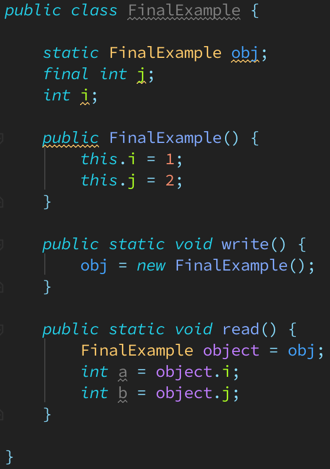

# About Java Memory Model (JSR 133) - Final

* 與前面介紹的lock/volatile相比, 對final field的read/write更像是對普通變數的存取.
  對於final field, 編譯器和處理器要遵守兩個重排序規則:
    * 在建構子內對一個final field的寫入, 與隨後把這個被建構物件的參照賦值給一個參考變數,
      這兩個操作之間不可以重排序.
    * 初次讀取一個包含final field的物件之參照, 與隨後初次讀取這個final field,
      這兩個操作之間不能重排序.

    * 以下就通過一些範例程式來說明這兩個規則:  
        
      這裡假設一個執行緒A執行write()方法, 緊接著另一個執行緒B執行read()方法.
      下面會通過這兩個執行緒的互動來說明這兩個規則.

* 寫入final field的重排序規則

* 讀取final field的重排序規則

* 如果final field是參照類型

* 為何final參照不能從建構子內"逸出"

* final語意在處理器中的實作

* JSR-133為什麼要增強final的語意
