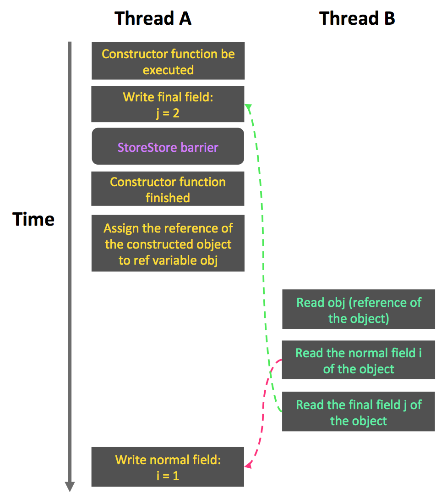

# About Java Memory Model (JSR 133) - Final

* 與前面介紹的lock/volatile相比, 對final field的read/write更像是對普通變數的存取.
  對於final field, 編譯器和處理器要遵守兩個重排序規則:
    * 在建構子內對一個final field的寫入, 與隨後把這個被建構物件的參照賦值給一個參考變數,
      這兩個操作之間不可以重排序.
    * 初次讀取一個包含final field的物件之參照, 與隨後初次讀取這個final field,
      這兩個操作之間不能重排序.

    * 以下就通過一些範例程式來說明這兩個規則:  
        
      這裡假設一個執行緒A執行write()方法, 緊接著另一個執行緒B執行read()方法.
      下面會通過這兩個執行緒的互動來說明這兩個規則.

* 寫入final field的重排序規則
    * 寫入final field的重排序規則禁止把final field的寫入重排序到建構子之外. 這條規則的實作包含以下2個方面:
        * JMM禁止編譯器把final field的寫入重排序至建構子之外.
        * 編譯器會在final field的寫入之後, 建構子的return之前, 插入一個StoreStore屏障.
          這個屏障會禁止處理器把final field的寫入排序到建構子之外.

    * 現在來看看write()方法. write()方法只包含一行程式:  
      **obj = new FinalExample();**  
      這行程式包含兩個步驟:
      * 建構一個FinalExample類型的物件
      * 把這個物件的參照賦值給參照變數obj

    * 假設執行緒B讀物件參照與讀物件的member field之間沒有重排序(稍後會說明為什麼要這樣假設),
      下圖是一種可能的執行時序:  
        
      在上圖中, 寫入普通變數的操作被編譯器重排序到了建構子之外, 執行緒B錯誤地讀取了普通變數i初始化之前的值;
      而寫入final變數的操作, 被寫入final field的重排序規則"限制"在了建構子之內, 執行緒B正確地讀取了final變數初始化之後的值.

    * 寫入final變數的重排序規則可以確保: **在物件參照為任意執行緒可見之前, 物件的final變數已經被正確初始化過了**,
      然而, 普通變數不具有這種保障. 以上圖為例, 在執行緒B"看到"物件參照obj時, 很有可能obj物件還沒有建構完成
      (對普通變數i的寫入操作被重排序到建構子外, 此時初始值2還沒有寫入普通變數i).

* 讀取final field的重排序規則

* 如果final field是參照類型

* 為何final參照不能從建構子內"逸出"

* final語意在處理器中的實作

* JSR-133為什麼要增強final的語意
