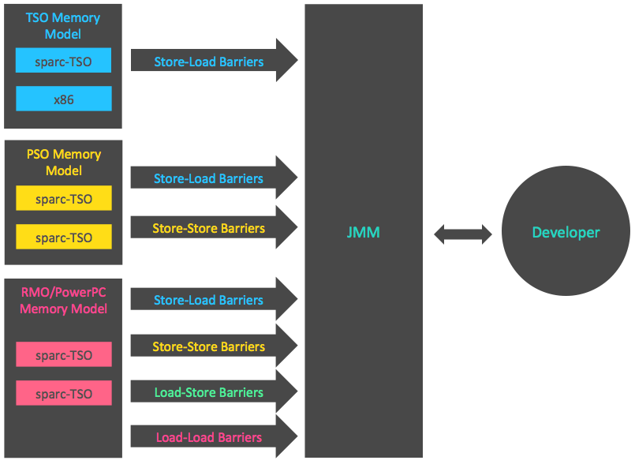

# About Java Memory Model (JSR 133) - Summary

* 處理器記憶體模型
    * 順序一致性記憶體模型(下簡稱SC model)是一個理論參考模型, JMM和處理器記憶體模型在設計時,
      通常會把SC model作為參考. JMM和處理器記憶體模型在設計時會對SC model做一些放鬆,
      因為如果完全按照SC model來實作處理器和JMM, 那麼很多的處理器/編譯器最佳化都會被禁止,
      這對執行效能會有非常大的影響.

    * 根據對不同類型讀/寫操作組合的執行順序之放寬, 可以把常見處理器的記憶體模型劃分為以下幾種:
        1. 放寬程式中寫-讀操作的順序, 由此產生了total store ordering記憶體模型(簡稱TSO)
        2. 在前者的基礎上, 繼續放寬程式中寫-寫操作的順序, 由此產生了partial store order記憶體模型(簡稱為PSO)
        3. 在前面兩者的基礎上, 繼續放寬程式中讀-寫和讀-讀操作的順序, 藉此產生了relaxed memory order記憶體模型(簡稱為RMO)和PowerPC記憶體模型.

        要注意的是, 這裡處理器對讀/寫操作的放寬, 是以兩個操作之間不存在資料相依性為前提的
        (因為處理器要遵守as-if-serial語意, 處理器不會對存在資料相依性的兩個記憶體操作進行重排序).

    * 以下表格顯示了常見處理器記憶體模型的細節特徵  
        
      在這張表格中, 可以看到所有處理器記憶體模型都允許寫-讀重排序, 原因在第一章有提過: **因為它們都使用了write buffer**,
      write buffer可能導致寫-讀操作重排序. 同時, 我們可以看到這些處理器記憶體模型都允許更早讀到當前處理器的寫入,
      原因同樣是因為write buffer: 由於write buffer僅對當前處理器可見,
      這個特性導致當前處理器可以比其它處理器早一步看到臨時保存在自己的write buffer中的寫入內容.

    * 上面表格中的各種處理器記憶體模型, 從上到下, 模型由強至弱. 越是追求性能的處理器, 記憶體模型通常就設計的越弱.
      因為這些處理器希望記憶體模型對其束縛越少越好, 這樣它們才可以做盡可能多的最佳化來提高性能.
      由於常見的處理器記憶體模型比JMM要弱, Java編譯器在產生byte code時, 會在執行指令序列的適當位置插入記憶體屏障
      來限制處理器的重排序. 同時, 由於各種處理器記憶體模型的強弱並不相同, 為了在不同的處理器平台向開發者們展示一個
      一致的記憶體模型, JMM在不同的處理器中需要插入的記憶體屏障之數量和種類也不相同. 下圖是JMM在不同處理器記憶體模型中
      需要插入的記憶體屏障的示意圖:  
        
      如上圖所示, JMM屏蔽了不同處理器記憶體模型的差異, 其在不同的處理器平台之上為Java開發者呈現了一個一致的記憶體模型.

* JMM, 處理器記憶體模型與順序一致性記憶體模型之間的關係

* JMM的設計

* JMM的記憶體可見性保證

* JSR-133對舊記憶體模型的修補
